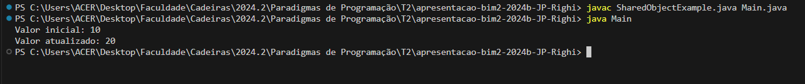

# Projeto: Programação Concorrente - Quiz

Este projeto explora conceitos fundamentais de programação concorrente por meio de exemplos práticos e explicações detalhadas. Focado na análise de uma classe Java utilizada em ambientes de múltiplas threads, o trabalho destaca os desafios de compartilhamento de recursos e condições de corrida.

---

## 📋 Índice
1. [Sobre o Projeto](#sobre-o-projeto)
2. [Questões e Soluções](#questões-e-soluções)
3. [Por que as Alternativas Erradas Estão Erradas?](#por-que-as-alternativas-erradas-estão-erradas)
4. [Comentários sobre Programação Concorrente](#comentários-sobre-programação-concorrente)
5. [Estrutura do Código](#estrutura-do-código)
6. [Conclusões](#conclusões)

---

## 🧐 Sobre o Projeto
O projeto utiliza a classe `SharedObjectExample` como exemplo para ilustrar conceitos de programação concorrente em Java. A partir do código fornecido, discutimos as seguintes questões:
1. Como instanciar objetos da classe.
2. Como o compartilhamento de objetos entre threads afeta a execução e a consistência dos dados.

O objetivo é demonstrar como a ausência de sincronização pode levar a problemas como condições de corrida e inconsistências.

---

## ❓ Questões e Soluções

### Código do Quiz
Considere o seguinte código:

```java
class SharedObjectExample {
  private int sharedValue;

  public SharedObjectExample(int value) {
    this.sharedValue = value;
  }

  public void updateValue(int newValue) {
    sharedValue = newValue;
  }

  public int getValue() {
    return sharedValue;
  }
}
```

### Questão 1: Como instanciar um objeto da classe `SharedObjectExample`?
A linha correta para instanciar um objeto é:

```java
SharedObjectExample e = new SharedObjectExample(10);
```

O construtor da classe requer um argumento para inicializar o valor compartilhado (`sharedValue`). A alternativa `SharedObjectExample e = new SharedObjectExample();` é inválida, pois a classe não possui um construtor sem argumentos.

---

### Questão 2: Como objetos da classe são compartilhados entre threads?
Alternativas:

- Objetos da classe SharedObjectExample sào sempre compartilhados entre threads.
- O compartilhamento de objetos da classe SharedObjectExample é definido por quem usa a classe.
- Objetos da classe SharedObjectExample não podem ser compartilhados porque são privados.
- Objetos da classe SharedObjectExample são automaticamente synchronized, tornando-os thread-safe.

A afirmativa correta é:

O compartilhamento de objetos da classe SharedObjectExample é definido por quem usa a classe.

Isso significa que o comportamento concorrente depende de como as instâncias da classe são utilizadas. Quando várias threads acessam a mesma instância, é possível que ocorram **condições de corrida**, já que a classe não é thread-safe.

---

## ❌ Por que as Alternativas Erradas Estão Erradas?

### **Questão 1:**  
**Alternativa errada:**  
SharedObjectExample e = new SharedObjectExample();  

**Motivo do erro:**  
O código tenta instanciar um objeto da classe `SharedObjectExample` sem fornecer um argumento. Contudo, a classe **não possui um construtor sem argumentos**. O único construtor disponível na classe exige que um valor inteiro seja passado como parâmetro para inicializar o campo `sharedValue`. Como o código não atende a essa exigência, ele resultará em um erro de compilação.

---

### **Questão 2:**  

**Alternativa errada:**  
Objetos da classe SharedObjectExample são sempre compartilhados entre threads.  

**Motivo do erro:**  
Nem todas as instâncias da classe `SharedObjectExample` são necessariamente compartilhadas entre threads. O compartilhamento depende de como o objeto é utilizado no código. Se um objeto for acessado apenas por uma única thread, ele não será compartilhado. Portanto, a afirmação é **falsa**, pois o compartilhamento de objetos não é obrigatório, mas opcional e depende do contexto de uso.

---

**Alternativa errada:**  
Objetos da classe SharedObjectExample não podem ser compartilhados porque são privados.  

**Motivo do erro:**  
O modificador `private` utilizado no campo `sharedValue` restringe o acesso direto ao atributo, mas isso **não impede o compartilhamento de objetos da classe**. O objeto em si pode ser compartilhado entre threads desde que uma referência a ele seja disponibilizada. O que "privado" restringe é o acesso direto ao campo `sharedValue`, mas métodos públicos (como `getValue` e `updateValue`) ainda permitem acesso ao valor compartilhado.

---

**Alternativa errada:**  
Objetos da classe SharedObjectExample são automaticamente synchronized, tornando-os thread-safe.  

**Motivo do erro:**  
Nenhum comportamento de sincronização automática está implementado na classe `SharedObjectExample`. Para que uma classe seja **thread-safe**, é necessário sincronizar explicitamente o acesso aos recursos compartilhados (usando palavras-chave como `synchronized`) ou utilizar classes utilitárias de concorrência, como `ReentrantLock`. Sem essas medidas, a classe não é protegida contra condições de corrida. Portanto, a afirmação é **falsa**.

---

## 💡 Comentários sobre Programação Concorrente

### 1. **Condições de Corrida**
Condições de corrida ocorrem quando múltiplas threads acessam e modificam uma variável compartilhada simultaneamente, sem controle adequado. Isso pode levar a resultados inconsistentes ou erros difíceis de reproduzir.

### 2. **Sincronização**
Para tornar a classe `SharedObjectExample` thread-safe, é necessário usar sincronização. Por exemplo, o método `updateValue` poderia ser modificado assim:

public synchronized void updateValue(int newValue) {
    sharedValue = newValue;
}

Isso garante que apenas uma thread execute o método por vez, evitando condições de corrida.

---

## 📂 Estrutura do Código
Estrutura básica do projeto:

.
├── src/
│   ├── SharedObjectExample.java
│   └── Main.java
└── README.md

---

## 🚀 Testando o Código

Para testar o código da solução, utilizei o Visual Studio Code, que já estava instalado no meu ambiente. Criei dois arquivos Java no mesmo diretório: `SharedObjectExample.java` e `Main.java`. 

No arquivo `Main.java`, implementei o seguinte código para demonstrar o uso da classe `SharedObjectExample`:

```java
public class Main {
    public static void main(String[] args) {
        SharedObjectExample sharedObject = new SharedObjectExample(10);

        System.out.println("Valor inicial: " + sharedObject.getValue());

        sharedObject.updateValue(20);
        System.out.println("Valor atualizado: " + sharedObject.getValue());
    }
}
```


### 🔧 Passos Executados

1. Criei os arquivos `SharedObjectExample.java` e `Main.java` no mesmo diretório.
2. Compilei os arquivos utilizando o seguinte comando no terminal: `javac SharedObjectExample.java Main.java`.
3. Executei o programa com o comando: `java Main`.
4. A saída foi exibida no terminal, conforme esperado:
   - Valor inicial: 10
   - Valor atualizado: 20

### 📷 Demonstração de Execução

Abaixo está uma imagem demonstrando a saída do programa após a execução:




---

## 📝 Conclusões
Este projeto demonstra a importância de compreender como objetos são compartilhados entre threads e como usar mecanismos de sincronização para evitar problemas de concorrência. A ausência de controle pode levar a inconsistências, enquanto o uso de práticas adequadas, como métodos sincronizados, promove a segurança e previsibilidade.

---
